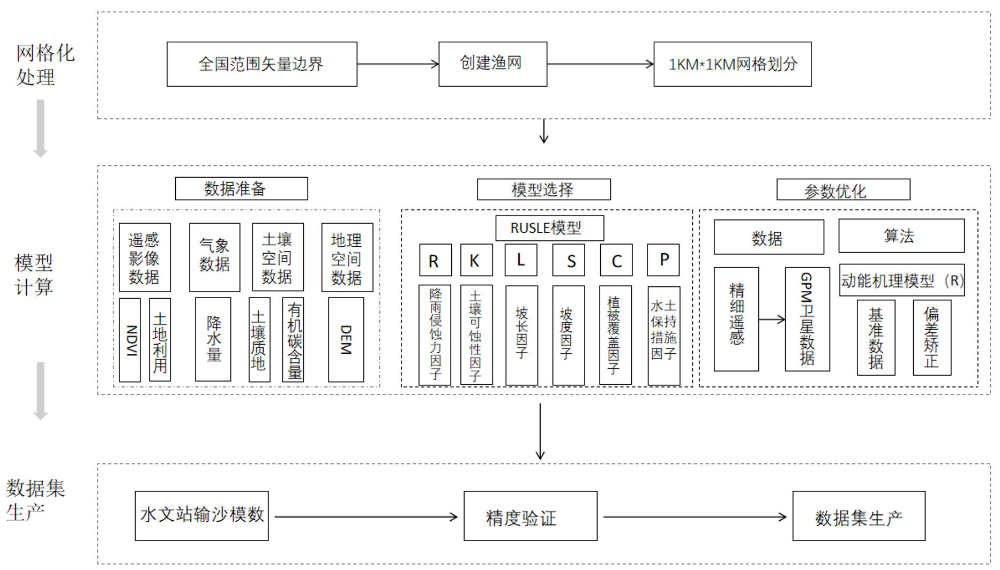
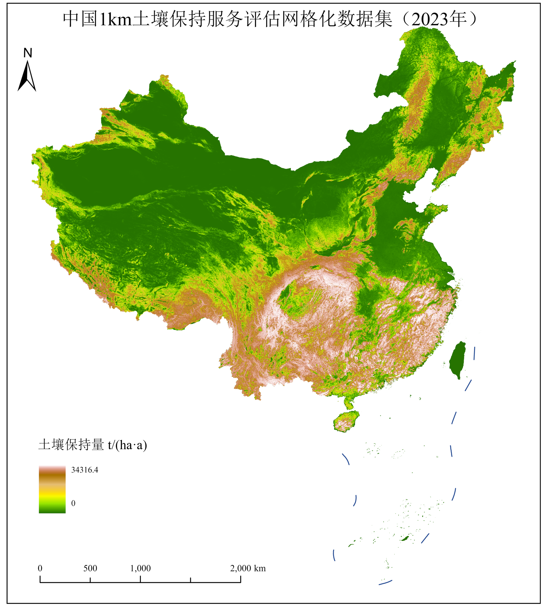

# China 1-km Gridded Soil Retention Service Dataset for 2023

[中文](README.md) | **English**

2023 · China · 1 km × 1 km · GeoTIFF · t/(ha·a)

## Overview

This soil retention service assessment dataset was produced by Professor Zhuowei Hu's research group at Capital Normal University under Task 3 (2023YFF1303703) of the National Key Research and Development Program of China project “Intelligent Big Data Mining Technologies for Large-Scale Ecological Quality and Ecosystem Service Assessment and the Development and Demonstration of a Gridded Key-Parameter Platform.”

It provides annual soil retention estimates for China in 2023 on a 1-km grid. The dataset **can be used for** national and regional analyses of soil retention patterns, integrated ecosystem service assessments, and ecological conservation and restoration research. In combination with local evidence, it can also support research on priority areas for erosion control, spatial planning for sloping cropland management, watershed ecological compensation, and evaluation of soil and water conservation measures.

## Dataset information

| Item | Description |
| --- | --- |
| Year | 2023 (one annual layer) |
| Spatial scope | National-scale China; actual valid coverage is defined by the raster mask |
| Spatial resolution | 1000 m × 1000 m |
| Variable and unit | Annual soil retention per unit area, t/(ha·a) (tonnes per hectare per year) |
| Format | GeoTIFF |
| File | `China_Soil_Retention_Service_2023_1km.tif` |
| File size | 48,343,873 bytes (approximately 46.10 MiB) |
| Bands / data type | 1 / Float32 |
| Dimensions | 4833 columns × 5515 rows |
| CRS | Custom Albers Equal Area Conic projection on the WGS 84 datum; coordinates in metres |
| Projection parameters | Central meridian 105°; latitude of origin 0°; standard parallels 25° and 47°; false easting/northing 0 m |
| XY coordinate system | Albers_Conic_Equal_Area |
| NoData | `-3.4028230607370965e+38` |
| Valid range | 0–34316.43359375 t/(ha·a) |
| Valid cells | 9,526,506 |
| Compression | LZW |
| Producer | Capital Normal University |
| Version | v1.0.0 |

The spatial reference, dimensions, NoData value and valid range were obtained by reading the original GeoTIFF and checking the entire raster. The unit was confirmed by the data provider; the original band unit tag is empty. See the [metadata file](metadata/dataset_metadata.json) for complete metadata and projected coordinate bounds. WGS 84 is the datum; it does not mean the raster uses geographic longitude/latitude coordinates (EPSG:4326).

## Download

Download `China_Soil_Retention_Service_2023_1km.tif` and `SHA256SUMS.txt` from this repository's [**Releases**](https://github.com/Hwx0513/ChinaSoilRetention-1km-2023/releases) page. The original raster bytes are preserved without reprojection, resampling or numerical changes. The repository's “Download ZIP” contains documentation, metadata and figures, but not the national GeoTIFF.

Verify the download against the checksum file with `sha256sum China_Soil_Retention_Service_2023_1km.tif` (Linux/macOS) or `Get-FileHash China_Soil_Retention_Service_2023_1km.tif -Algorithm SHA256` (PowerShell).

## Method

According to the research team's product documentation, annual soil retention was estimated using the Revised Universal Soil Loss Equation (RUSLE), with improvements to the rainfall erosivity factor:

1. Identify erosive rainfall events using high-temporal-resolution GPM satellite precipitation data.
2. Apply the RUSLE2 rainfall kinetic energy formulation to better represent rainfall erosion processes.
3. Downscale rainfall erosivity using an ensemble of XGBoost and random forest models.
4. Correct bias using long-term mean rainfall erosivity benchmarks from stations across China.



## Evaluation and scope of use

The following results are internal evaluations reported in the research team's product documentation. They do not imply completed on-site verification or expert review. The underlying validation observations, production model code and Monte Carlo inputs are not included here; these metrics have not been recomputed in this repository.

| Evaluation | Reported result |
| --- | --- |
| Erosion/sediment simulation validation | Sediment observations from 21 hydrological stations |
| Mean RMSE across selected stations | Reduced from 250.48 to 224.26 t/(km²·a), a 10.47% reduction |
| Monte Carlo analysis | Spatially aggregated coefficient of variation (CV) of soil retention: 0.206 after optimization |
| Relative uncertainty | Reduced by 46.19% under the input and parameter perturbations specified in the report |

## Spatial overview



The map was supplied by the research team and is for visual reference only. For quantitative analysis, read `China_Soil_Retention_Service_2023_1km.tif` rather than inferring values from map colours.

## Reading the data

Open the GeoTIFF in compatible GIS software, or install Python's `rasterio` and run:

```bash
python scripts/read_geotiff.py /path/to/China_Soil_Retention_Service_2023_1km.tif
```

## Related research paper

Zhao, L., Hu, Z., Wang, M., Liu, X., Hou, W., Wang, Y., Li, S., & Wang, J. (2025). Effects of Spatial Statistical Units on the Zoning of Ecosystem Soil Retention Services: A Case Study of the Loess Plateau. *Land Degradation & Development*. https://doi.org/10.1002/ldr.70171

## Data use statement

We make our data products available to the research community as we believe that the dissemination of our data will lead to advancement in science. If you plan to use our data in a manuscript or presentation, we request that you inform us at an early stage of your work. You should ensure that your research does not significantly overlap with what we are currently working on with this product. In addition, if our data are essential to your work, or if an important result or finding depends on our data, co-authorship may be appropriate. You should inform us of your analysis and publication plans well in advance of the submission of a paper, give us an opportunity to read and intellectually contribute to the manuscript, and, if appropriate, offer co-authorship. Contact: Dr. Zhuowei Hu (huzhuowei@cnu.edu.cn).

## Contacts

| Contact | Email |
| --- | --- |
| Task lead: Dr. Zhuowei Hu | [huzhuowei@cnu.edu.cn](mailto:huzhuowei@cnu.edu.cn) |
| Technical contact: Tianao Han | [2250902106@cnu.edu.cn](mailto:2250902106@cnu.edu.cn) |
